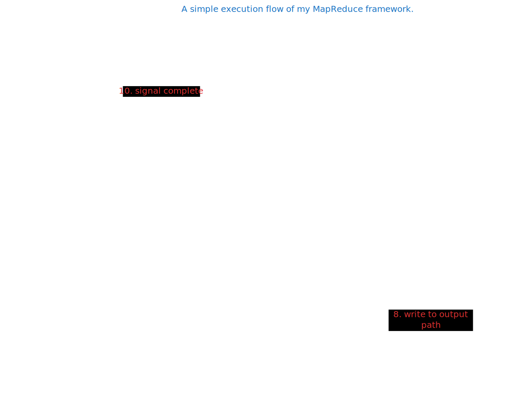

# map-reduce
Tinkering with golang and mapreduce

# How to compile
Pull the code, and run the `compile_source.sh` bash script. 

# How to run
In your root directory, navigate to the bin/ folder (`cd bin`) and then you can run using (`./mapreduce`)

You can specify a file to process using the `--file` argument. (`./mapreduce --file <file_name>`). If no file is specified it will default to look for `stressTest.txt`.

# TODO
This isn't intended to be used in production and is simply a side project for me, but some future things I'd like to add are:

* Make this multi-process and not just multi-threaded.
* Add a Pipeline architecture to allow you to chain multiple map and reduce functions together.
* Provide some way to configure the Pipeline.
* Support the system to work with directories and not files for input and output.
* Build something to normalize the data before feeding it through.
* Add an abstraction to utilise Go channels for data transfer instead of files for multi-threaded methods.

# A small flow diagram

